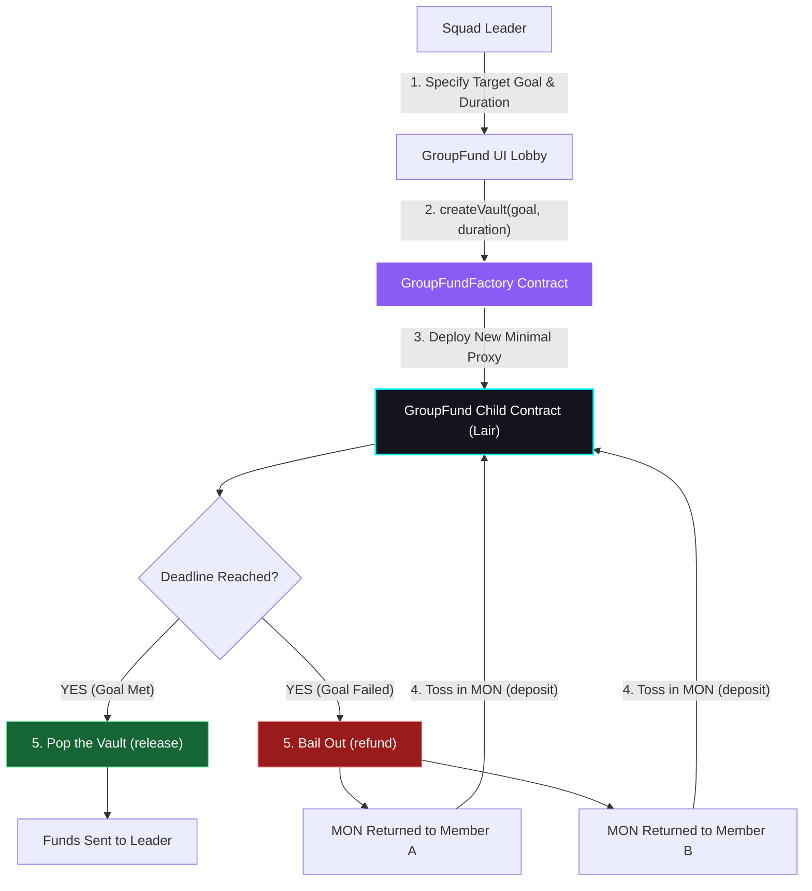

# 🚀 GroupFund: Squad Savings on Autopilot

GroupFund is a playful, trustless group savings pot factory built for the **Monad Hackathon**. 

With GroupFund, users can spin up custom, decentralized vault contracts ("Lair Vaults") to pool `MON` with friends for shared goals. If the squad hits the target before the clock runs out, the funds are released to the squad leader. If the deadline expires and the goal isn't met, the contract automatically guarantees a full bailout refund to all contributors.

---

## 🏛️ Smart Contract Factory Architecture

GroupFund employs a **Factory Design Pattern** to ensure trustless, sandboxed, and independent savings vaults. Instead of sharing a single contract with complex accounting, each new vault is deployed as a distinct, low-overhead child smart contract.

### Architectural Flow



### Deployed Contracts
* **GroupFundFactory (Monad Testnet)**: [`0x605501e50602111131a2367F6341BAd97B88dfFa`](https://testnet-rpc.monad.xyz/)

---

## ⚙️ Network Configuration

Ensure your Web3 wallet (MetaMask, OKX, etc.) is configured with the following strict network settings:

| Parameter | Value |
| :--- | :--- |
| **Network Name** | Monad Testnet |
| **New RPC URL** | `https://testnet-rpc.monad.xyz/` |
| **Chain ID** | `10143` (Hex: `0x279f`) |
| **Currency Symbol** | `MON` |
| **Block Explorer** | `https://testnet.monadexplorer.com/` |

---

## 🎨 UI/UX Features & Animations

GroupFund features a premium, responsive dark-mode layout built with **Tailwind CSS v4** and **Framer Motion**, focusing on interactive micro-interactions:

* **State-Based Animated Router**: Seamlessly switch between the global Lobby and individual Lair Vaults with slide-up and fade-in animations.
* **Ticking Balance Counter**: Watch your pooled funds count up from zero with custom quadratic easing when you enter a vault's dashboard.
* **Dynamic Emoji Pulse Frequency**: The Hype emoji (`🔥`) next to the progress bar adjusts its pulse rate dynamically. At 0% funded it pulses slowly (every `2.0s`), accelerating to a fast vibration (every `0.2s`) as the pool approaches 100%.
* **Staggered Lairs Reveal**: Vault cards in the Lobby load sequentially with staggered entry frames and custom glowing hover scale-ups.
* **Input Focus Shimmer**: The "Toss in MON" input triggers a shifting background light shimmer once selected, drawing focus to the contribution action.
* **Transaction Toast Overlays**: A custom-designed alert stack notifications overlay that displays transaction states (Initiating, Pending Confirmation, Success, Reverted) dynamically.

---

## 🛠️ Quick Start

### Prerequisites
- Node.js (version 20+ recommended)
- npm or yarn

### Installation

1. Clone the repository and navigate to the directory:
   ```bash
   cd Groupfunds
   ```

2. Install dependencies:
   ```bash
   npm install
   ```

3. Run the local development server:
   ```bash
   npm run dev
   ```
   Open **[http://localhost:5173](http://localhost:5173)** in your browser.

4. Build for production:
   ```bash
   npm run build
   ```
